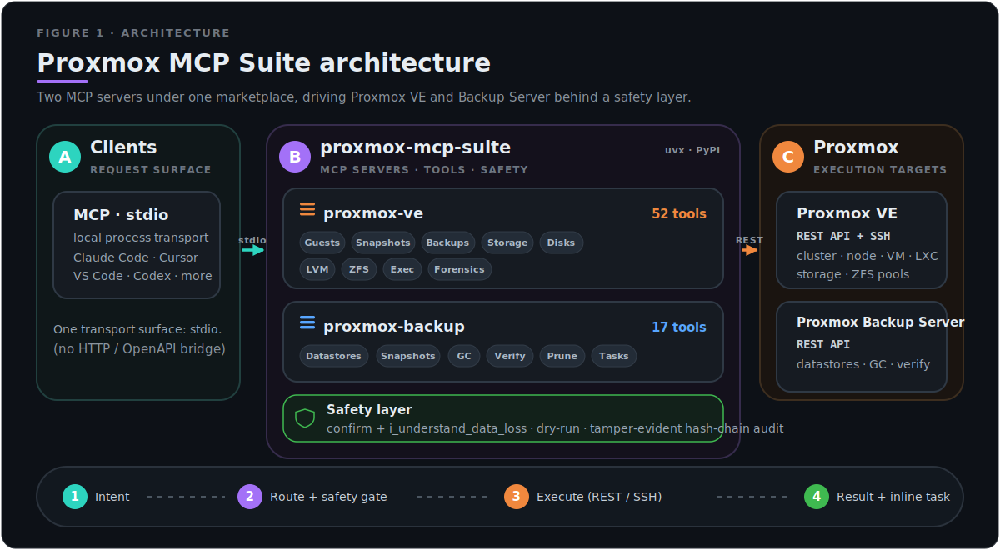
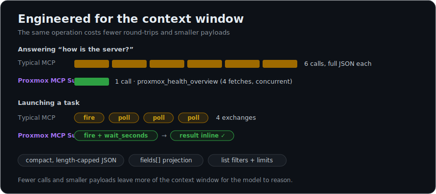
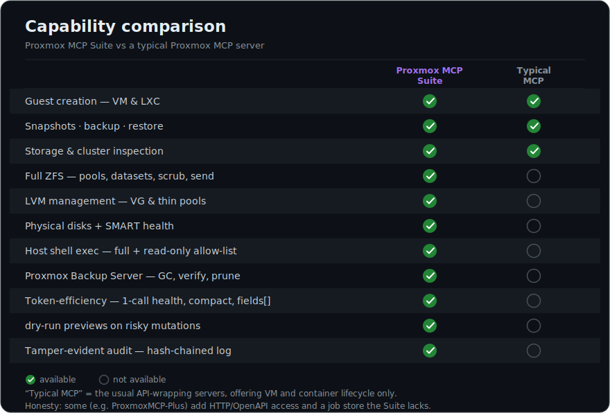

<h1 align="center">Proxmox MCP Suite</h1>

<p align="center">
  <strong>Run your Proxmox VE cluster and Backup Server from Claude — deeply, safely, and without drowning the context window.</strong>
</p>

<p align="center">
  
  
  <a href="https://pypi.org/project/pve-mcp/"></a>
  <a href="https://pypi.org/project/pbs-mcp/"></a>
  
  
  
  
</p>

<p align="center">
  <a href="#-quick-start">Quick start</a> ·
  <a href="#-why-this-suite">Why this suite</a> ·
  <a href="#-whats-inside">What's inside</a> ·
  <a href="#-safety-model">Safety</a> ·
  <a href="#-configuration">Config</a>
</p>

---

Two [Model Context Protocol](https://modelcontextprotocol.io/) servers, packaged
as Claude Code plugins, that turn Claude into a **capable Proxmox operator** —
**69 tools** across virtualization and backup, engineered to run *inside an
LLM's context*: compact output, one-call health, inline task results, and a
two-tier safety model with dry-run previews and a **tamper-evident audit trail**.

<p align="center">
  
</p>

## ⚡ Quick start

Prereq: [Claude Code](https://claude.com/claude-code) and [`uv`](https://docs.astral.sh/uv/) (`uvx`). The servers run via `uvx` — nothing to `pip install` by hand.

```text
/plugin marketplace add ahmetem/proxmox-mcp-suite
/plugin install proxmox-ve@proxmox-mcp-suite
/plugin install proxmox-backup@proxmox-mcp-suite
```

Export your Proxmox credentials (see [Configuration](#-configuration)), restart
Claude Code, and ask:

> *"How is the server? Any storage filling up?"* — one `proxmox_health_overview` call.
>
> *"Snapshot VM 102 as pre-upgrade, then reboot it."*
>
> *"Is my last backup of CT 200 healthy?"*

## 🎯 Why this suite

Most Proxmox MCP servers wrap the API and hand Claude raw JSON. This one is
built for the thing that actually constrains an agent — **context** — and for
**not breaking your infrastructure**.

<p align="center">
  
</p>

| | **Proxmox MCP Suite** | Typical Proxmox MCP |
|---|---|---|
| **Output** | Compact, length-capped JSON · one-call `health_overview` · list filters · `fields` projection | Verbose full-object dumps |
| **Task launches** | `wait_seconds` polls the task and returns the **final result inline** | Fire, then a second call to check status |
| **Mutations** | Two-tier gate: `confirm` **+** `i_understand_data_loss`, plus `dry_run` previews on the risky ones | Single flag, or nothing |
| **Auditability** | Host/guest shell exec appended to a **hash-chained, tamper-evident** log (`proxmox_audit_verify`) | Plain log, or none |
| **Depth (VE)** | Guests, snapshots, backups, storage, disks, **LVM, full ZFS, disk-prep, provisioning, task forensics, backup self-heal** | VM/CT lifecycle only |
| **Backup (PBS)** | Dedicated server: datastores, snapshots, **GC, verify, prune**, read-only by default | Usually absent |
| **Install** | One marketplace, `uvx` — zero manual Python setup | Clone + venv + pip + JSON config |

> Modular by design — install only Proxmox VE, only PBS, or both.

## 📦 What's inside

<p align="center">
  
</p>

### `proxmox-ve` — 52 tools

<sub>Repo: [`homelab-proxmox-mcp`](https://github.com/ahmetem/homelab-proxmox-mcp)</sub>

- **Guests** — list/status, create VM & LXC from scratch, clone, power, resize
- **Snapshots** — create / rollback / delete (data-loss gated)
- **Backups** — vzdump create / list / restore (refuses silent overwrite)
- **Storage & disks** — pools, usage breakdown, physical disks + SMART
- **LVM / ZFS** — VG/thin, full ZFS: pools, datasets, snapshots, scrub, send, properties, disk-prepare & provisioning
- **Exec** — guest-VM SSH, host SSH (free + a read-only allow-listed variant safe for agents), LXC `pct exec`, service control, log tail
- **Forensics & self-heal** — task list/logs, backup-job inspection, stale `@vzdump` snapshot cleanup that unblocks failing backups

### `proxmox-backup` — 17 tools

<sub>Repo: [`homelab-pbs-mcp`](https://github.com/ahmetem/homelab-pbs-mcp)</sub>

- **Datastores & snapshots** — status, usage, list, protect/forget
- **Maintenance** — garbage collection, verify jobs, prune (with dry-run)
- **Tasks** — status and logs by UPID
- **Read-only by default** — write-side tools stay inert until `PBS_ALLOW_WRITE=true`

## 🛡️ Safety model

Read-only tools run freely. Everything that changes state requires `confirm=true`;
anything that destroys persistent data *additionally* requires
`i_understand_data_loss=true` — so Claude only fires these after you clearly ask.

- **`dry_run` previews** on the highest-consequence mutations (create VM/CT,
  clone, restore) return the exact API call they *would* make (secrets masked),
  without touching anything.
- **Tamper-evident audit** — every host/guest shell exec is appended to a
  hash-chained log (SHA-256, or HMAC-SHA256 with `PROXMOX_AUDIT_HMAC_KEY`).
  `proxmox_audit_verify` recomputes the chain and flags any altered, deleted,
  or reordered line.
- **Token auth, never root passwords** — API tokens are revocable and scope the
  blast radius.

## ⚙️ Configuration

Credentials are passed to the servers via environment variables — export them in
the shell that launches Claude Code (no secret is stored in the plugin).

**Proxmox VE** — required: `PROXMOX_HOST`, `PROXMOX_USER`, `PROXMOX_TOKEN_NAME`,
`PROXMOX_TOKEN_VALUE`. Optional: `PROXMOX_PORT`, `PROXMOX_VERIFY_SSL`, and the
SSH-backed tools' `PROXMOX_SSH_*`. → full list in the
[server repo](https://github.com/ahmetem/homelab-proxmox-mcp).

**Proxmox Backup Server** — required: `PBS_HOST`, `PBS_TOKEN_ID`,
`PBS_TOKEN_SECRET`, `PBS_NODE`. Optional: `PBS_VERIFY_TLS`,
`PBS_DEFAULT_DATASTORE`, and **`PBS_ALLOW_WRITE`** (gates GC/prune/forget). →
[PBS server repo](https://github.com/ahmetem/homelab-pbs-mcp).

Verify servers loaded with `/mcp`.

## 🔧 How it runs

Each plugin launches its server with `uvx`, which fetches, installs and isolates
it automatically from PyPI ([`pve-mcp`](https://pypi.org/project/pve-mcp/),
[`pbs-mcp`](https://pypi.org/project/pbs-mcp/)) — no clone, no virtualenv, no
manual `pip install`. `uvx` caches the environment after the first launch, so
later starts are instant. To pin a specific release, set a plugin's `args` to
e.g. `["pve-mcp==1.2.0"]`.

## 🔒 Security notes

- Keep the Proxmox / PBS APIs on a trusted LAN or behind a VPN.
- Privilege-separate the API tokens; grant the narrowest role that works.
- Don't remove the `confirm` / `i_understand_data_loss` guards.

## 📄 License

[GNU General Public License v3.0](https://github.com/ahmetem/homelab-proxmox-mcp/blob/main/LICENSE).
Not affiliated with or endorsed by Proxmox Server Solutions GmbH. "Proxmox" is a
trademark of its respective owner.
